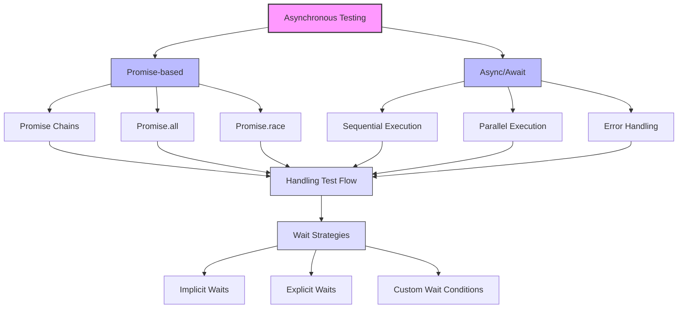

```mermaid
graph TD
    A[Asynchronous Testing] --> B[Promise-based]
    A --> C[Async/Await]
    
    B --> B1[Promise Chains]
    B --> B2[Promise.all]
    B --> B3[Promise.race]
    
    C --> C1[Sequential Execution]
    C --> C2[Parallel Execution]
    C --> C3[Error Handling]
    
    B1 --> D[Handling Test Flow]
    B2 --> D
    B3 --> D
    C1 --> D
    C2 --> D
    C3 --> D
    
    D --> E[Wait Strategies]
    E --> E1[Implicit Waits]
    E --> E2[Explicit Waits]
    E --> E3[Custom Wait Conditions]
    
    style A fill:#f9f,stroke:#333,stroke-width:2px
    style B fill:#bbf,stroke:#333,stroke-width:1px
    style C fill:#bbf,stroke:#333,stroke-width:1px
    style D fill:#ddf,stroke:#333,stroke-width:1px
    style E fill:#ddf,stroke:#333,stroke-width:1px
```
