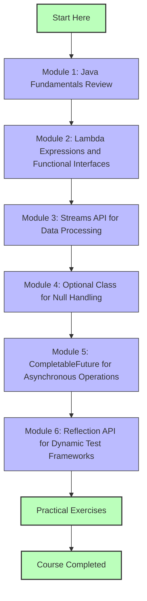

```mermaid
graph TD
    Start[Start Here] --> M1[Module 1: Java Fundamentals Review]
    M1 --> M2[Module 2: Lambda Expressions and Functional Interfaces]
    M2 --> M3[Module 3: Streams API for Data Processing]
    M3 --> M4[Module 4: Optional Class for Null Handling]
    M4 --> M5[Module 5: CompletableFuture for Asynchronous Operations]
    M5 --> M6[Module 6: Reflection API for Dynamic Test Frameworks]
    M6 --> PE[Practical Exercises]
    PE --> End[Course Completed]
    
    classDef module fill:#bbf,stroke:#333,stroke-width:1px;
    classDef milestone fill:#bfb,stroke:#333,stroke-width:2px;
    
    class M1,M2,M3,M4,M5,M6 module;
    class Start,PE,End milestone;
```
