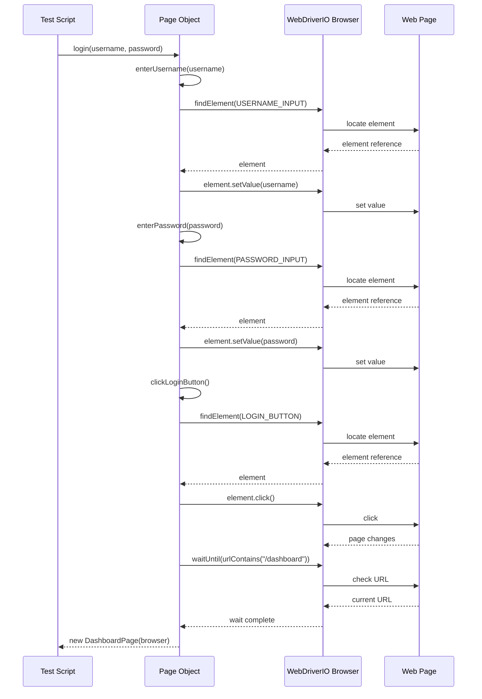

```mermaid
sequenceDiagram
    participant Test as Test Script
    participant PO as Page Object
    participant Browser as WebDriverIO Browser
    participant Web as Web Page

    Test->>PO: login(username, password)
    PO->>PO: enterUsername(username)
    PO->>Browser: findElement(USERNAME_INPUT)
    Browser->>Web: locate element
    Web-->>Browser: element reference
    Browser-->>PO: element
    PO->>Browser: element.setValue(username)
    Browser->>Web: set value
    
    PO->>PO: enterPassword(password)
    PO->>Browser: findElement(PASSWORD_INPUT)
    Browser->>Web: locate element
    Web-->>Browser: element reference
    Browser-->>PO: element
    PO->>Browser: element.setValue(password)
    Browser->>Web: set value
    
    PO->>PO: clickLoginButton()
    PO->>Browser: findElement(LOGIN_BUTTON)
    Browser->>Web: locate element
    Web-->>Browser: element reference
    Browser-->>PO: element
    PO->>Browser: element.click()
    Browser->>Web: click
    Web-->>Browser: page changes
    
    PO->>Browser: waitUntil(urlContains("/dashboard"))
    Browser->>Web: check URL
    Web-->>Browser: current URL
    Browser-->>PO: wait complete
    
    PO-->>Test: new DashboardPage(browser)
```
