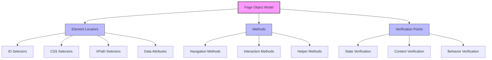

```mermaid
graph TD
    A[Page Object Model] --> B[Element Locators]
    A --> C[Methods]
    A --> D[Verification Points]
    
    B --> B1[ID Selectors]
    B --> B2[CSS Selectors]
    B --> B3[XPath Selectors]
    B --> B4[Data Attributes]
    
    C --> C1[Navigation Methods]
    C --> C2[Interaction Methods]
    C --> C3[Helper Methods]
    
    D --> D1[State Verification]
    D --> D2[Content Verification]
    D --> D3[Behavior Verification]
    
    style A fill:#f9f,stroke:#333,stroke-width:2px
    style B fill:#bbf,stroke:#333,stroke-width:1px
    style C fill:#bbf,stroke:#333,stroke-width:1px
    style D fill:#bbf,stroke:#333,stroke-width:1px
```
