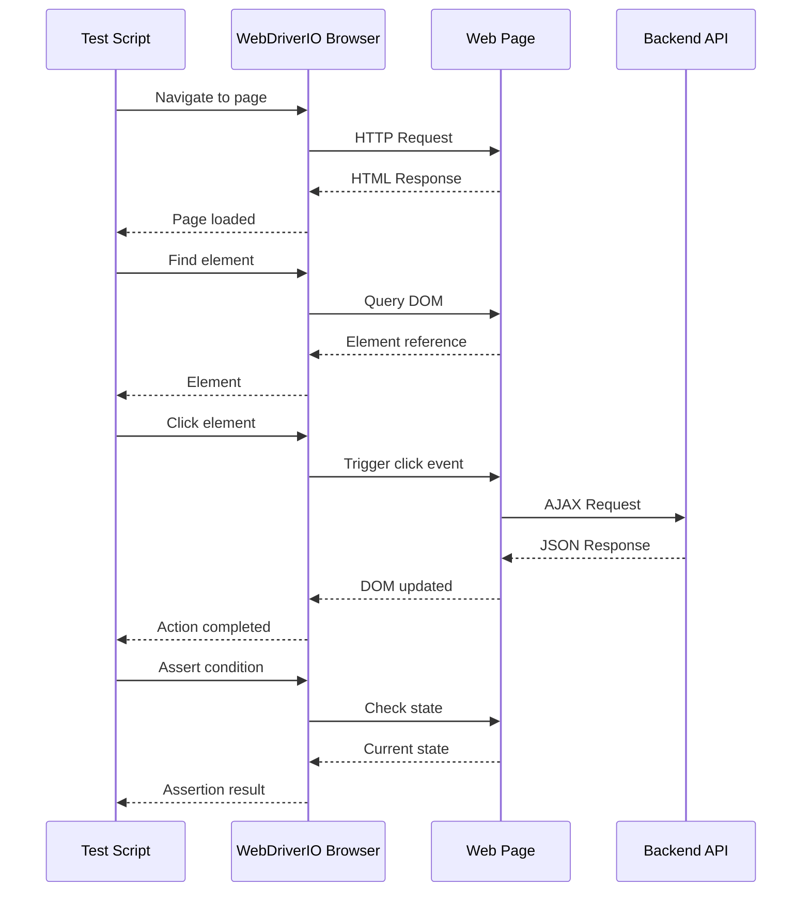

```mermaid
sequenceDiagram
    participant Test as Test Script
    participant Browser as WebDriverIO Browser
    participant Web as Web Page
    participant API as Backend API
    
    Test->>Browser: Navigate to page
    Browser->>Web: HTTP Request
    Web-->>Browser: HTML Response
    Browser-->>Test: Page loaded
    
    Test->>Browser: Find element
    Browser->>Web: Query DOM
    Web-->>Browser: Element reference
    Browser-->>Test: Element
    
    Test->>Browser: Click element
    Browser->>Web: Trigger click event
    Web->>API: AJAX Request
    API-->>Web: JSON Response
    Web-->>Browser: DOM updated
    Browser-->>Test: Action completed
    
    Test->>Browser: Assert condition
    Browser->>Web: Check state
    Web-->>Browser: Current state
    Browser-->>Test: Assertion result
```
