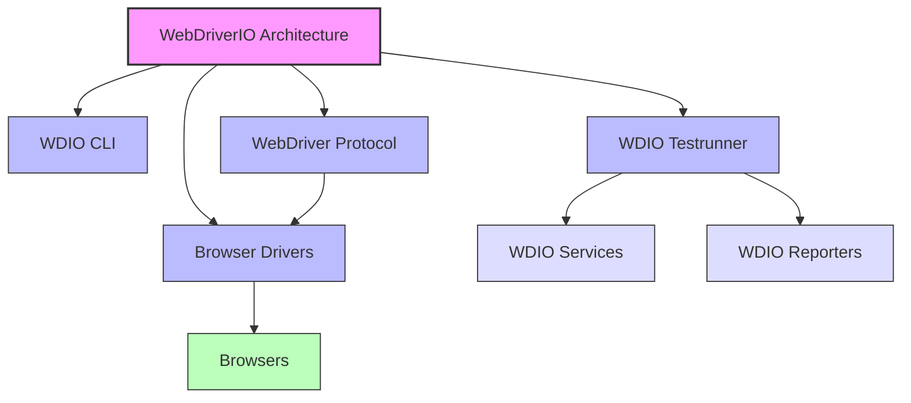

```mermaid
graph TD
    A[WebDriverIO Architecture] --> B[WDIO CLI]
    A --> C[WDIO Testrunner]
    A --> D[WebDriver Protocol]
    A --> E[Browser Drivers]
    
    C --> F[WDIO Services]
    C --> G[WDIO Reporters]
    
    D --> E
    E --> H[Browsers]
    
    style A fill:#f9f,stroke:#333,stroke-width:2px
    style B fill:#bbf,stroke:#333,stroke-width:1px
    style C fill:#bbf,stroke:#333,stroke-width:1px
    style D fill:#bbf,stroke:#333,stroke-width:1px
    style E fill:#bbf,stroke:#333,stroke-width:1px
    style F fill:#ddf,stroke:#333,stroke-width:1px
    style G fill:#ddf,stroke:#333,stroke-width:1px
    style H fill:#bfb,stroke:#333,stroke-width:1px
```
