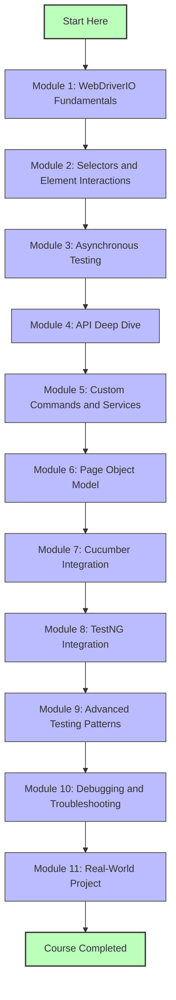

```mermaid
graph TD
    Start[Start Here] --> M1[Module 1: WebDriverIO Fundamentals]
    M1 --> M2[Module 2: Selectors and Element Interactions]
    M2 --> M3[Module 3: Asynchronous Testing]
    M3 --> M4[Module 4: API Deep Dive]
    M4 --> M5[Module 5: Custom Commands and Services]
    M5 --> M6[Module 6: Page Object Model]
    M6 --> M7[Module 7: Cucumber Integration]
    M7 --> M8[Module 8: TestNG Integration]
    M8 --> M9[Module 9: Advanced Testing Patterns]
    M9 --> M10[Module 10: Debugging and Troubleshooting]
    M10 --> M11[Module 11: Real-World Project]
    M11 --> End[Course Completed]
    
    classDef module fill:#bbf,stroke:#333,stroke-width:1px;
    classDef milestone fill:#bfb,stroke:#333,stroke-width:2px;
    
    class M1,M2,M3,M4,M5,M6,M7,M8,M9,M10,M11 module;
    class Start,End milestone;
```
