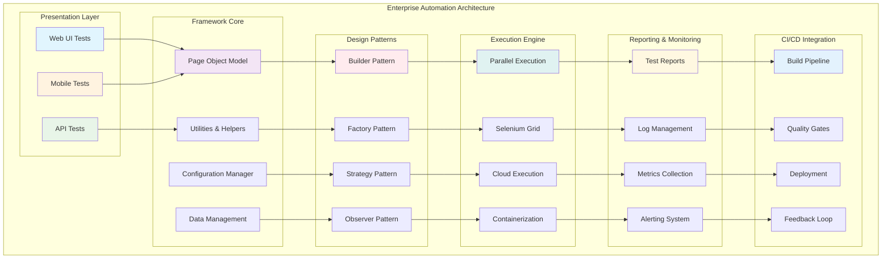

```mermaid
graph TB
    subgraph "Enterprise Automation Architecture"
        subgraph "Presentation Layer"
            UI[Web UI Tests]
            API[API Tests]
            Mobile[Mobile Tests]
        end
        
        subgraph "Framework Core"
            POM[Page Object Model]
            Utils[Utilities & Helpers]
            Config[Configuration Manager]
            Data[Data Management]
        end
        
        subgraph "Design Patterns"
            Builder[Builder Pattern]
            Factory[Factory Pattern]
            Strategy[Strategy Pattern]
            Observer[Observer Pattern]
        end
        
        subgraph "Execution Engine"
            Parallel[Parallel Execution]
            Grid[Selenium Grid]
            Cloud[Cloud Execution]
            Docker[Containerization]
        end
        
        subgraph "Reporting & Monitoring"
            Reports[Test Reports]
            Logs[Log Management]
            Metrics[Metrics Collection]
            Alerts[Alerting System]
        end
        
        subgraph "CI/CD Integration"
            Pipeline[Build Pipeline]
            Gates[Quality Gates]
            Deploy[Deployment]
            Feedback[Feedback Loop]
        end
    end
    
    UI --> POM
    API --> Utils
    Mobile --> POM
    
    POM --> Builder
    Utils --> Factory
    Config --> Strategy
    Data --> Observer
    
    Builder --> Parallel
    Factory --> Grid
    Strategy --> Cloud
    Observer --> Docker
    
    Parallel --> Reports
    Grid --> Logs
    Cloud --> Metrics
    Docker --> Alerts
    
    Reports --> Pipeline
    Logs --> Gates
    Metrics --> Deploy
    Alerts --> Feedback
    
    style UI fill:#e1f5fe
    style API fill:#e8f5e8
    style Mobile fill:#fff3e0
    style POM fill:#f3e5f5
    style Builder fill:#ffebee
    style Parallel fill:#e0f2f1
    style Reports fill:#fff8e1
    style Pipeline fill:#e3f2fd
```

