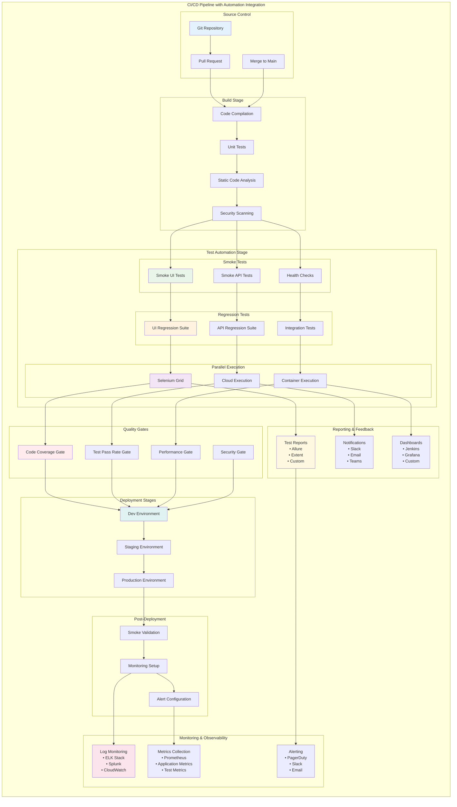

```mermaid
graph LR
    subgraph "CI/CD Pipeline with Automation Integration"
        subgraph "Source Control"
            Git[Git Repository]
            PR[Pull Request]
            Merge[Merge to Main]
        end
        
        subgraph "Build Stage"
            Compile[Code Compilation]
            UnitTests[Unit Tests]
            StaticAnalysis[Static Code Analysis]
            SecurityScan[Security Scanning]
        end
        
        subgraph "Test Automation Stage"
            subgraph "Smoke Tests"
                SmokeUI[Smoke UI Tests]
                SmokeAPI[Smoke API Tests]
                HealthCheck[Health Checks]
            end
            
            subgraph "Regression Tests"
                UIRegression[UI Regression Suite]
                APIRegression[API Regression Suite]
                IntegrationTests[Integration Tests]
            end
            
            subgraph "Parallel Execution"
                GridExecution[Selenium Grid]
                CloudExecution[Cloud Execution]
                ContainerExecution[Container Execution]
            end
        end
        
        subgraph "Quality Gates"
            CoverageGate[Code Coverage Gate]
            TestPassRate[Test Pass Rate Gate]
            PerformanceGate[Performance Gate]
            SecurityGate[Security Gate]
        end
        
        subgraph "Deployment Stages"
            DevDeploy[Dev Environment]
            StagingDeploy[Staging Environment]
            ProdDeploy[Production Environment]
        end
        
        subgraph "Post-Deployment"
            SmokeValidation[Smoke Validation]
            MonitoringSetup[Monitoring Setup]
            AlertConfiguration[Alert Configuration]
        end
        
        subgraph "Reporting & Feedback"
            TestReports[Test Reports<br/>• Allure<br/>• Extent<br/>• Custom]
            Notifications[Notifications<br/>• Slack<br/>• Email<br/>• Teams]
            Dashboards[Dashboards<br/>• Jenkins<br/>• Grafana<br/>• Custom]
        end
        
        subgraph "Monitoring & Observability"
            LogMonitoring[Log Monitoring<br/>• ELK Stack<br/>• Splunk<br/>• CloudWatch]
            MetricsCollection[Metrics Collection<br/>• Prometheus<br/>• Application Metrics<br/>• Test Metrics]
            Alerting[Alerting<br/>• PagerDuty<br/>• Slack<br/>• Email]
        end
    end
    
    Git --> PR
    PR --> Compile
    Merge --> Compile
    
    Compile --> UnitTests
    UnitTests --> StaticAnalysis
    StaticAnalysis --> SecurityScan
    
    SecurityScan --> SmokeUI
    SecurityScan --> SmokeAPI
    SecurityScan --> HealthCheck
    
    SmokeUI --> UIRegression
    SmokeAPI --> APIRegression
    HealthCheck --> IntegrationTests
    
    UIRegression --> GridExecution
    APIRegression --> CloudExecution
    IntegrationTests --> ContainerExecution
    
    GridExecution --> CoverageGate
    CloudExecution --> TestPassRate
    ContainerExecution --> PerformanceGate
    
    CoverageGate --> DevDeploy
    TestPassRate --> DevDeploy
    PerformanceGate --> DevDeploy
    SecurityGate --> DevDeploy
    
    DevDeploy --> StagingDeploy
    StagingDeploy --> ProdDeploy
    
    ProdDeploy --> SmokeValidation
    SmokeValidation --> MonitoringSetup
    MonitoringSetup --> AlertConfiguration
    
    GridExecution --> TestReports
    CloudExecution --> Notifications
    ContainerExecution --> Dashboards
    
    MonitoringSetup --> LogMonitoring
    AlertConfiguration --> MetricsCollection
    TestReports --> Alerting
    
    style Git fill:#e3f2fd
    style SmokeUI fill:#e8f5e8
    style UIRegression fill:#fff3e0
    style GridExecution fill:#f3e5f5
    style CoverageGate fill:#ffebee
    style DevDeploy fill:#e0f2f1
    style TestReports fill:#fff8e1
    style LogMonitoring fill:#fce4ec
```

