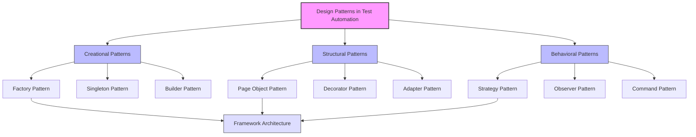

```mermaid
graph TD
    A[Design Patterns in Test Automation] --> B[Creational Patterns]
    A --> C[Structural Patterns]
    A --> D[Behavioral Patterns]
    
    B --> B1[Factory Pattern]
    B --> B2[Singleton Pattern]
    B --> B3[Builder Pattern]
    
    C --> C1[Page Object Pattern]
    C --> C2[Decorator Pattern]
    C --> C3[Adapter Pattern]
    
    D --> D1[Strategy Pattern]
    D --> D2[Observer Pattern]
    D --> D3[Command Pattern]
    
    C1 --> E[Framework Architecture]
    B1 --> E
    D1 --> E
    
    style A fill:#f9f,stroke:#333,stroke-width:2px
    style B fill:#bbf,stroke:#333,stroke-width:1px
    style C fill:#bbf,stroke:#333,stroke-width:1px
    style D fill:#bbf,stroke:#333,stroke-width:1px
    style E fill:#ddf,stroke:#333,stroke-width:1px
```