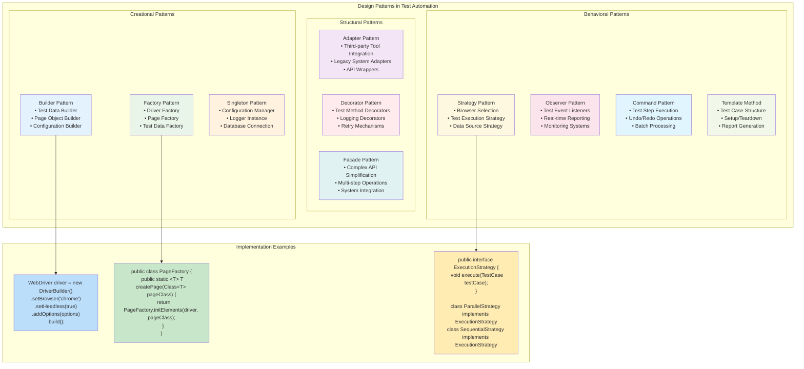

```mermaid
graph TB
    subgraph "Design Patterns in Test Automation"
        subgraph "Creational Patterns"
            Builder[Builder Pattern<br/>• Test Data Builder<br/>• Page Object Builder<br/>• Configuration Builder]
            Factory[Factory Pattern<br/>• Driver Factory<br/>• Page Factory<br/>• Test Data Factory]
            Singleton[Singleton Pattern<br/>• Configuration Manager<br/>• Logger Instance<br/>• Database Connection]
        end
        
        subgraph "Structural Patterns"
            Adapter[Adapter Pattern<br/>• Third-party Tool Integration<br/>• Legacy System Adapters<br/>• API Wrappers]
            Decorator[Decorator Pattern<br/>• Test Method Decorators<br/>• Logging Decorators<br/>• Retry Mechanisms]
            Facade[Facade Pattern<br/>• Complex API Simplification<br/>• Multi-step Operations<br/>• System Integration]
        end
        
        subgraph "Behavioral Patterns"
            Strategy[Strategy Pattern<br/>• Browser Selection<br/>• Test Execution Strategy<br/>• Data Source Strategy]
            Observer[Observer Pattern<br/>• Test Event Listeners<br/>• Real-time Reporting<br/>• Monitoring Systems]
            Command[Command Pattern<br/>• Test Step Execution<br/>• Undo/Redo Operations<br/>• Batch Processing]
            Template[Template Method<br/>• Test Case Structure<br/>• Setup/Teardown<br/>• Report Generation]
        end
    end
    
    subgraph "Implementation Examples"
        BuilderEx["WebDriver driver = new DriverBuilder()<br/>.setBrowser('chrome')<br/>.setHeadless(true)<br/>.addOptions(options)<br/>.build();"]
        
        FactoryEx["public class PageFactory {<br/>  public static &lt;T&gt; T createPage(Class&lt;T&gt; pageClass) {<br/>    return PageFactory.initElements(driver, pageClass);<br/>  }<br/>}"]
        
        StrategyEx["public interface ExecutionStrategy {<br/>  void execute(TestCase testCase);<br/>}<br/><br/>class ParallelStrategy implements ExecutionStrategy<br/>class SequentialStrategy implements ExecutionStrategy"]
    end
    
    Builder --> BuilderEx
    Factory --> FactoryEx
    Strategy --> StrategyEx
    
    style Builder fill:#e3f2fd
    style Factory fill:#e8f5e8
    style Singleton fill:#fff3e0
    style Adapter fill:#f3e5f5
    style Decorator fill:#ffebee
    style Facade fill:#e0f2f1
    style Strategy fill:#fff8e1
    style Observer fill:#fce4ec
    style Command fill:#e1f5fe
    style Template fill:#f1f8e9
    
    style BuilderEx fill:#bbdefb
    style FactoryEx fill:#c8e6c9
    style StrategyEx fill:#ffecb3
```

