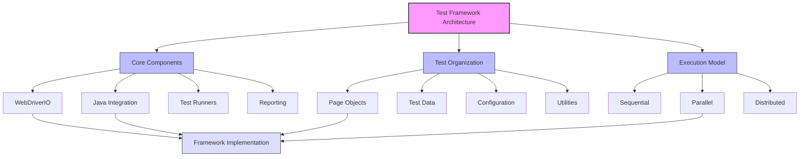

```mermaid
graph TD
    A[Test Framework Architecture] --> B[Core Components]
    A --> C[Test Organization]
    A --> D[Execution Model]
    
    B --> B1[WebDriverIO]
    B --> B2[Java Integration]
    B --> B3[Test Runners]
    B --> B4[Reporting]
    
    C --> C1[Page Objects]
    C --> C2[Test Data]
    C --> C3[Configuration]
    C --> C4[Utilities]
    
    D --> D1[Sequential]
    D --> D2[Parallel]
    D --> D3[Distributed]
    
    B1 --> E[Framework Implementation]
    B2 --> E
    C1 --> E
    D2 --> E
    
    style A fill:#f9f,stroke:#333,stroke-width:2px
    style B fill:#bbf,stroke:#333,stroke-width:1px
    style C fill:#bbf,stroke:#333,stroke-width:1px
    style D fill:#bbf,stroke:#333,stroke-width:1px
    style E fill:#ddf,stroke:#333,stroke-width:1px
```