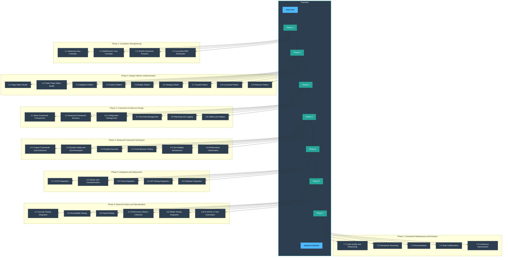

```mermaid
%%{init: {'flowchart': {'nodeSpacing': 50, 'rankSpacing': 100, 'curve': 'basis'}}}%%
graph TB
    subgraph Overview
        Start[Start Here] --> P1
        P1 --> P2
        P2 --> P3
        P3 --> P4
        P4 --> P5
        P5 --> P6
        P6 --> P7
        P7 --> Mastery[Mastery Achieved!]
    end
    
    subgraph Phase1[Phase 1: Foundation Strengthening]
        P1[Phase 1] --> P1.1[1.1 Advanced Java Concepts]
        P1 --> P1.2[1.2 WebDriverIO Core Concepts]
        P1 --> P1.3[1.3 TestNG Advanced Features]
        P1 --> P1.4[1.4 Cucumber BDD Techniques]
    end
    
    subgraph Phase2[Phase 2: Design Patterns Implementation]
        P2[Phase 2] --> P2.1[2.1 Page Object Model]
        P2 --> P2.2[2.2 Fluent Page Object Model]
        P2 --> P2.3[2.3 Singleton Pattern]
        P2 --> P2.4[2.4 Factory Pattern]
        P2 --> P2.5[2.5 Builder Pattern]
        P2 --> P2.6[2.6 Strategy Pattern]
        P2 --> P2.7[2.7 Facade Pattern]
        P2 --> P2.8[2.8 Command Pattern]
        P2 --> P2.9[2.9 Observer Pattern]
    end
    
    subgraph Phase3[Phase 3: Framework Architecture Design]
        P3[Phase 3] --> P3.1[3.1 Base Framework Components]
        P3 --> P3.2[3.2 Advanced Framework Structure]
        P3 --> P3.3[3.3 Configuration Management]
        P3 --> P3.4[3.4 Test Data Management]
        P3 --> P3.5[3.5 Reporting and Logging]
        P3 --> P3.6[3.6 Utilities and Helpers]
    end
    
    subgraph Phase4[Phase 4: Advanced Framework Techniques]
        P4[Phase 4] --> P4.1[4.1 Custom Commands and Extensions]
        P4 --> P4.2[4.2 Dynamic Waits and Synchronization]
        P4 --> P4.3[4.3 Parallel Execution]
        P4 --> P4.4[4.4 Cross-Browser Testing]
        P4 --> P4.5[4.5 Test Stability Mechanisms]
        P4 --> P4.6[4.6 Performance Optimization]
    end
    
    subgraph Phase5[Phase 5: Integration and Deployment]
        P5[Phase 5] --> P5.1[5.1 CI/CD Integration]
        P5 --> P5.2[5.2 Docker and Containerization]
        P5 --> P5.3[5.3 Cloud Integration]
        P5 --> P5.4[5.4 API Testing Integration]
        P5 --> P5.5[5.5 Database Integration]
    end
    
    subgraph Phase6[Phase 6: Advanced Topics and Specialization]
        P6[Phase 6] --> P6.1[6.1 Security Testing Integration]
        P6 --> P6.2[6.2 Accessibility Testing]
        P6 --> P6.3[6.3 Visual Testing]
        P6 --> P6.4[6.4 Performance Metrics Collection]
        P6 --> P6.5[6.5 Mobile Testing Integration]
        P6 --> P6.6[6.6 AI and ML in Test Automation]
    end
    
    subgraph Phase7[Phase 7: Framework Maintenance and Evolution]
        P7[Phase 7] --> P7.1[7.1 Code Quality and Refactoring]
        P7 --> P7.2[7.2 Framework Versioning]
        P7 --> P7.3[7.3 Documentation]
        P7 --> P7.4[7.4 Team Collaboration]
        P7 --> P7.5[7.5 Continuous Improvement]
    end
    
    classDef phase fill:#26a69a,stroke:#333,stroke-width:2px,color:#FFFFFF;
    classDef module fill:#2c3e50,stroke:#333,stroke-width:1px,color:#FFFFFF;
    classDef milestone fill:#4db8ff,stroke:#333,stroke-width:2px,color:#000000;
    classDef overview fill:#2c3e50,stroke:#26a69a,stroke-width:2px,color:#FFFFFF;
    
    class P1,P2,P3,P4,P5,P6,P7 phase;
    class P1.1,P1.2,P1.3,P1.4,P2.1,P2.2,P2.3,P2.4,P2.5,P2.6,P2.7,P2.8,P2.9,P3.1,P3.2,P3.3,P3.4,P3.5,P3.6,P4.1,P4.2,P4.3,P4.4,P4.5,P4.6,P5.1,P5.2,P5.3,P5.4,P5.5,P6.1,P6.2,P6.3,P6.4,P6.5,P6.6,P7.1,P7.2,P7.3,P7.4,P7.5 module;
    class Start,Mastery milestone;
    class Overview overview;
```