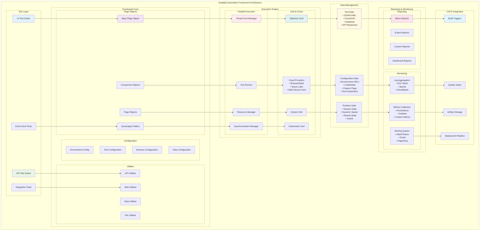

```mermaid
graph TB
    subgraph "Scalable Automation Framework Architecture"
        subgraph "Test Layer"
            UI_Tests[UI Test Suites]
            API_Tests[API Test Suites]
            Integration[Integration Tests]
            E2E[End-to-End Tests]
        end
        
        subgraph "Framework Core"
            subgraph "Page Objects"
                BasePage[Base Page Object]
                ComponentPO[Component Objects]
                PagePO[Page Objects]
                ScreenplayPO[Screenplay Pattern]
            end
            
            subgraph "Utilities"
                WebUtils[Web Utilities]
                APIUtils[API Utilities]
                DataUtils[Data Utilities]
                FileUtils[File Utilities]
            end
            
            subgraph "Configuration"
                EnvConfig[Environment Config]
                TestConfig[Test Configuration]
                BrowserConfig[Browser Configuration]
                DataConfig[Data Configuration]
            end
        end
        
        subgraph "Execution Engine"
            subgraph "Parallel Execution"
                ThreadPool[Thread Pool Manager]
                TestRunner[Test Runner]
                ResourceManager[Resource Manager]
                SyncManager[Synchronization Manager]
            end
            
            subgraph "Grid & Cloud"
                SeleniumGrid[Selenium Grid]
                CloudProviders[Cloud Providers<br/>• BrowserStack<br/>• Sauce Labs<br/>• AWS Device Farm]
                DockerGrid[Docker Grid]
                K8sGrid[Kubernetes Grid]
            end
        end
        
        subgraph "Data Management"
            TestData[Test Data<br/>• JSON/YAML<br/>• Excel/CSV<br/>• Database<br/>• API Responses]
            ConfigData[Configuration Data<br/>• Environment URLs<br/>• Credentials<br/>• Feature Flags<br/>• Test Parameters]
            RuntimeData[Runtime Data<br/>• Session Data<br/>• Dynamic Values<br/>• Shared State<br/>• Cache]
        end
        
        subgraph "Reporting & Monitoring"
            subgraph "Reporting"
                AllureReports[Allure Reports]
                ExtentReports[Extent Reports]
                CustomReports[Custom Reports]
                DashboardReports[Dashboard Reports]
            end
            
            subgraph "Monitoring"
                LogAggregation[Log Aggregation<br/>• ELK Stack<br/>• Splunk<br/>• CloudWatch]
                Metrics[Metrics Collection<br/>• Prometheus<br/>• Grafana<br/>• Custom Metrics]
                Alerting[Alerting System<br/>• Slack/Teams<br/>• Email<br/>• PagerDuty]
            end
        end
        
        subgraph "CI/CD Integration"
            BuildTrigger[Build Triggers]
            QualityGates[Quality Gates]
            ArtifactStorage[Artifact Storage]
            DeploymentPipeline[Deployment Pipeline]
        end
    end
    
    UI_Tests --> BasePage
    API_Tests --> APIUtils
    Integration --> WebUtils
    E2E --> ScreenplayPO
    
    BasePage --> ThreadPool
    ComponentPO --> TestRunner
    PagePO --> ResourceManager
    ScreenplayPO --> SyncManager
    
    ThreadPool --> SeleniumGrid
    TestRunner --> CloudProviders
    ResourceManager --> DockerGrid
    SyncManager --> K8sGrid
    
    SeleniumGrid --> TestData
    CloudProviders --> ConfigData
    DockerGrid --> RuntimeData
    
    TestData --> AllureReports
    ConfigData --> LogAggregation
    RuntimeData --> Metrics
    
    AllureReports --> BuildTrigger
    LogAggregation --> QualityGates
    Metrics --> ArtifactStorage
    Alerting --> DeploymentPipeline
    
    style UI_Tests fill:#e3f2fd
    style API_Tests fill:#e8f5e8
    style BasePage fill:#f3e5f5
    style ThreadPool fill:#ffebee
    style SeleniumGrid fill:#e0f2f1
    style TestData fill:#fff8e1
    style AllureReports fill:#fce4ec
    style BuildTrigger fill:#e1f5fe
```

